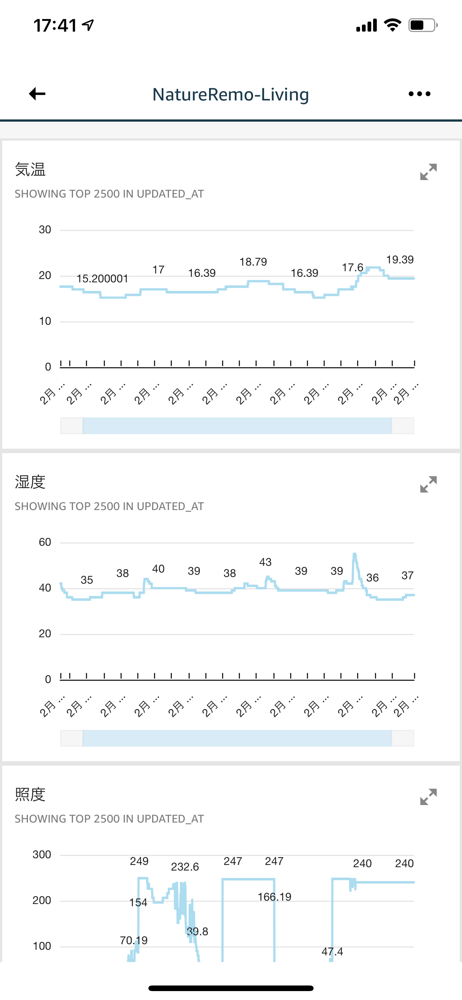

# natureremo-create-graph

Nature Remo APIを叩いてデフォルトでは見れない温度、湿度、明るさをグラフ化する



## Architecture
Lambda -> DynamoDB -> Glue -> S3 -> Athena -> QuickSight


## Hands on

[Hands-on contents is here.](./handson/summary.md) 

## 事前準備

API Token発行

https://home.nature.global/

## Data Modeling

sample Json data
http://swagger.nature.global/#/default/get_1_devices

```Json
[
  {
    "id": "3fa85f64-5717-4562-b3fc-2c963f66afa6",
    "name": "string",
    "temperature_offset": 0,
    "humidity_offset": 0,
    "created_at": "2020-01-20T01:43:56.774Z",
    "updated_at": "2020-01-20T01:43:56.774Z",
    "firmware_version": "string",
    "mac_address": "string",
    "serial_number": "string",
    "newest_events": {
      "te": {
        "val": 0,
        "created_at": "2020-01-20T01:43:56.774Z"
      },
      "hu": {
        "val": 0,
        "created_at": "2020-01-20T01:43:56.774Z"
      },
      "il": {
        "val": 0,
        "created_at": "2020-01-20T01:43:56.774Z"
      },
      "mo": {
        "val": 0,
        "created_at": "2020-01-20T01:43:56.774Z"
      }
    }
  }
]
```

### DynamoDB data modeling(Sample)

|SensorData type|DataType(PK)|updated_at(SK)|Value|
|---|---|---|---|
|device meta data|3fa85f64-5717-4562-b3fc-2c963f66afa6|2020-01-21T00:51:46Z (format:yyyy-MM-dd'T'HH:mm:ss'Z')|device_name and other info|
|Humidity|3fa85f64-5717-4562-b3fc-2c963f66afa6_Hu|2020-01-21T00:51:46Z|53.2|
|Temperature|3fa85f64-5717-4562-b3fc-2c963f66afa6_Te|2020-01-21T00:51:46Z|25.1|
|Illumination|3fa85f64-5717-4562-b3fc-2c963f66afa6_Il|2020-01-21T00:51:46Z|200.0|
|Movement|3fa85f64-5717-4562-b3fc-2c963f66afa6_Mo|2020-01-21T00:51:46Z|2.0|


# License
This library is licensed under the MIT-0 License. See the LICENSE file.


